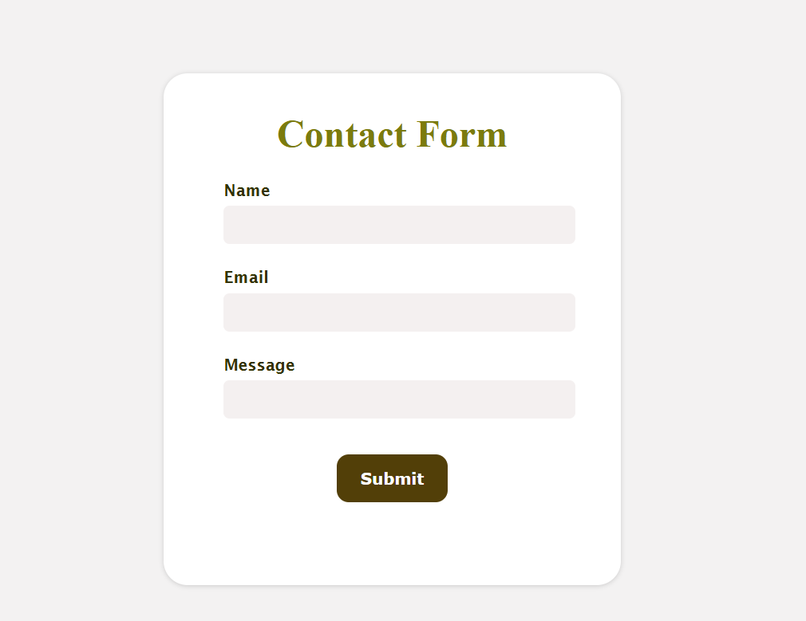
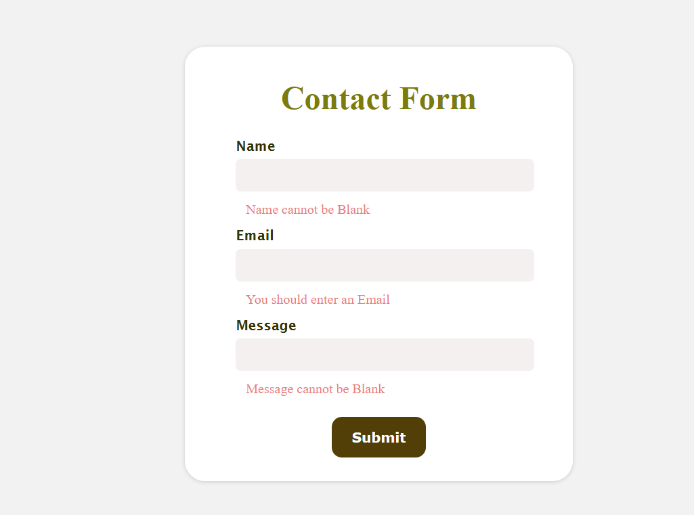
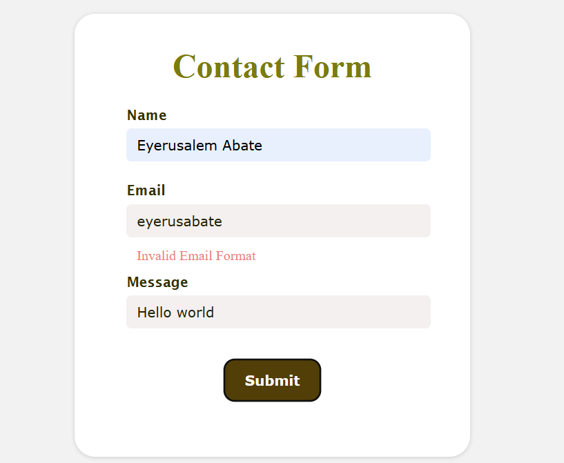
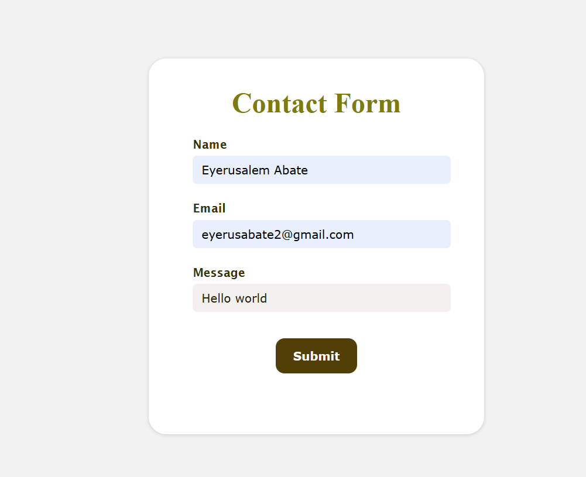

# Simple Contact Form

## Overview
This project is a simple contact form built using React and the react-hook-form library. It captures a user's name, email, and message, and validates the input fields before submitting the data. The form is lightweight, easy to integrate, and includes basic validation to ensure the inputs are correctly formatted.

## Features
**React Hook Form**: Utilizes react-hook-form for easy form management and validation.
**Validation**: Ensures that all fields are completed, and checks the email format.
**Automatic Reset**: Resets the form after a successful submission.
- **Error Messages**: Displays error messages for invalid form inputs.

## Instructions to Run the Project

### Clone the Repository
```bash
git clone https://github.com/yayne30/Practice/tree/main/contact_form
cd contact_form
npm install
npm run dev
```
Open your browser and navigate to http://localhost:3000 to view and interact with the contact form.

### Images

### default state with all fields empty


### displaying error messages indicating that the Name, Email, and Message fields are required.


### An error message for the Email field, indicating that the entered email format is invalid.


### With all fields filled out correctly and no error messages displayed


