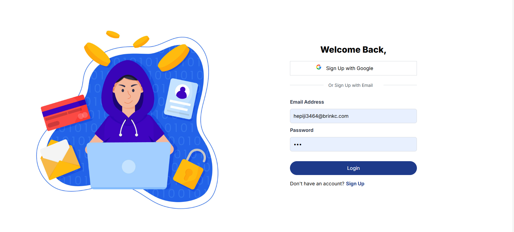
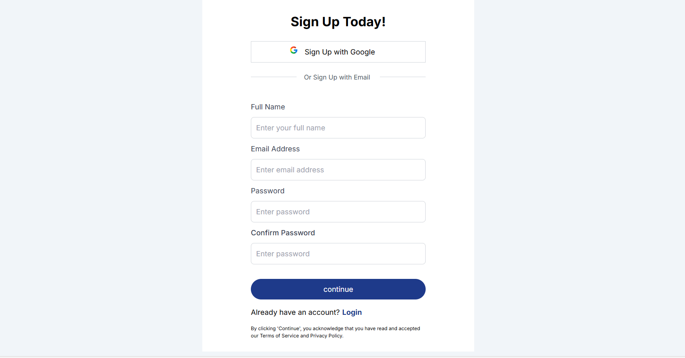
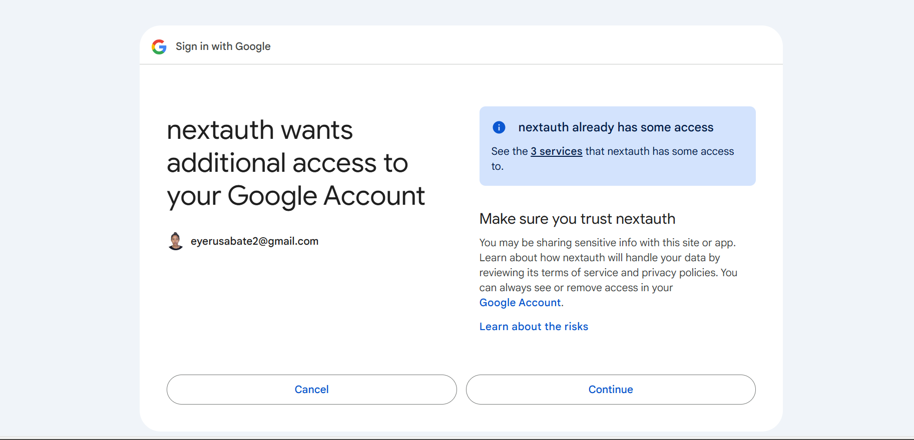
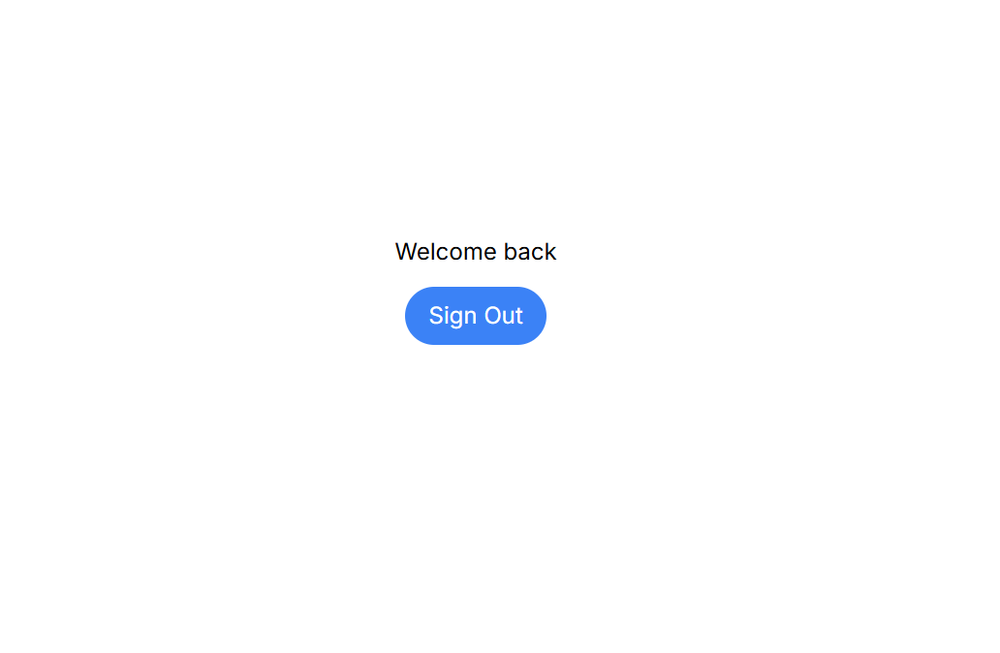
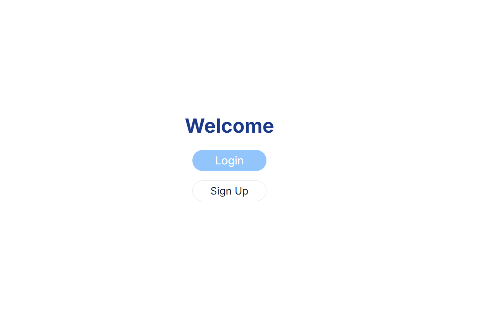

# Simple Contact Form

## Overview
This project is a user authentication and verification system built with Next.js, NextAuth, and Tailwind CSS. It features user signup, login, email verification, and a dashboard accessible upon successful authentication.

## Features
User Authentication: Secure user authentication using NextAuth with custom credential providers.
Email Verification: Users receive a verification code via email during signup, which they must enter to complete the registration process.
Dashboard Access: Authenticated users gain access to a personalized dashboard displaying their profile information.
Responsive Design: The UI is built with Tailwind CSS, ensuring responsiveness across different devices.

## Instructions to Run the Project

### Clone the Repository
```bash
git clone https://github.com/yourusername/nextauth.git
cd nextauth
npm install
```
Open your browser and navigate to http://localhost:3000 to view and interact with the page.

### Images

### Login page


### Sign up Page


### Google auth


### Google sign In page


### after Login


### Home


