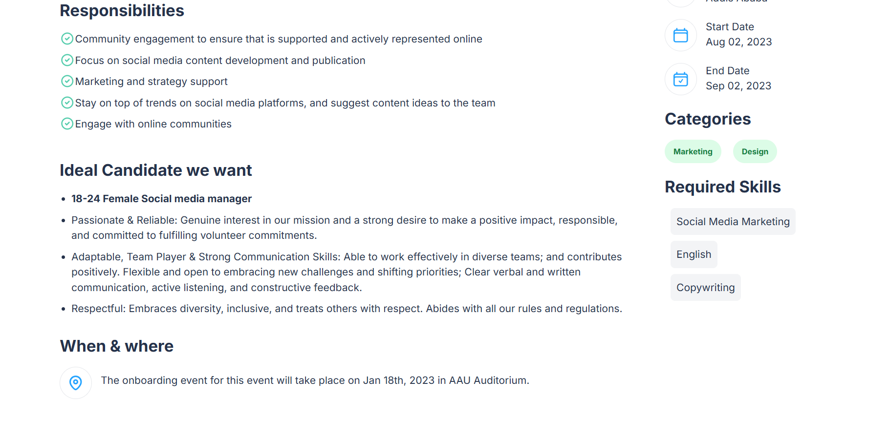
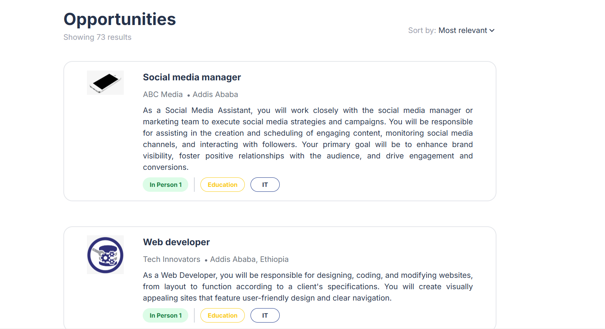

# Job Listing App
This repository contains a Job Listing App built with React and Next.js. The app displays a list of job opportunities and allows users to view detailed information about each job, including descriptions, responsibilities, ideal candidate traits, and logistical details such as the location and application deadline.
 ## Features
Job Listings: Display a list of job opportunities with key details.
Job Details: View detailed information about a specific job, including job description, responsibilities, ideal candidate traits, location, and application deadline.
Responsive Design: The app is designed to be fully responsive, ensuring usability across various devices.

## Installation
To get started with the Job Listing App, follow these steps:

 # Clone the repository:
```bash
Copy code
git clone https://github.com/your-username/job-listing-app.git
cd job-app
Install dependencies:

bash
Copy code
npm install
Run the development server:


=======

bash
Copy code
npm run dev
This will start the app on http://localhost:3000.


### Images

### The job applicant dashboard/ job details


### The job listing page



