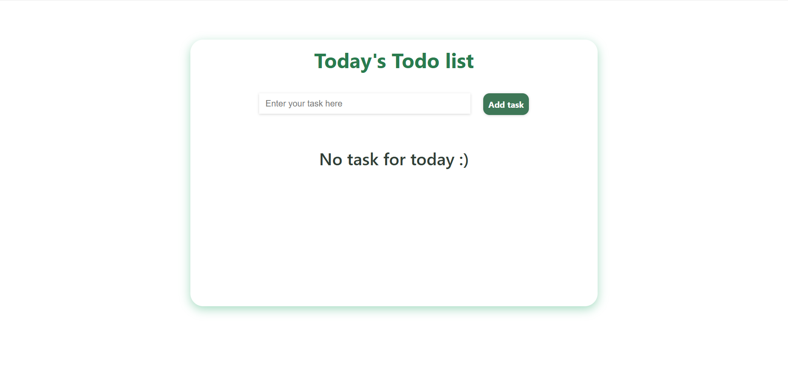
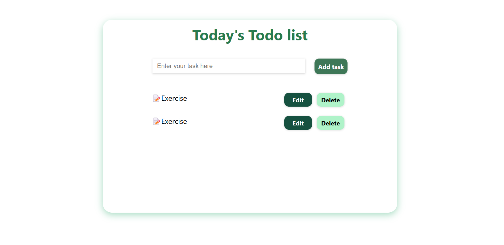

# Todo List Application 📝

This is a simple Todo List application built with React. It allows users to add, edit, and delete tasks. The app helps users keep track of their daily tasks efficiently.

## Features

- **Add Task:** Users can add a new task by typing into the input field and clicking the "Add task" button.
- **Edit Task:** Users can edit an existing task by clicking the "Edit" button, modifying the task text, and saving the changes.
- **Delete Task:** Users can delete a task by clicking the "Delete" button.

## Usage
Add a Task:

Type your task into the input field.
Click on the "Add task" button to add it to the list.
Edit a Task:

Click the "Edit" button next to the task you want to modify.
Change the text in the input field that appears.
Click "Save" to update the task.
Delete a Task:

Click the "Delete" button next to the task you want to remove from the list.


## Installation

### Clone the Repository
```bash
git clone https://github.com/yayne30/Practice/tree/main/todo_list
cd todo_list
npm install
npm run dev
```
Open your browser and navigate to http://localhost:3000 to view and interact with the todo_list.

### Images

### default state with no task


### displays the todo list



    
